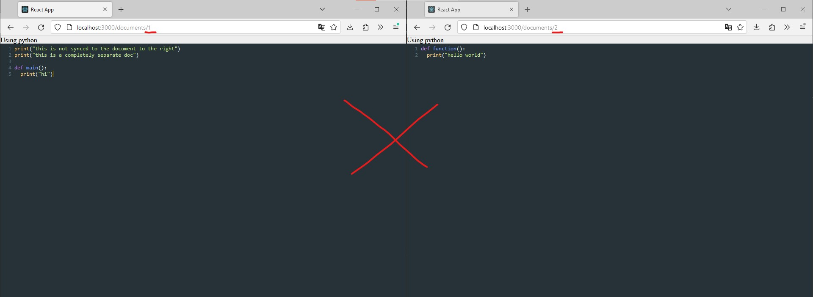
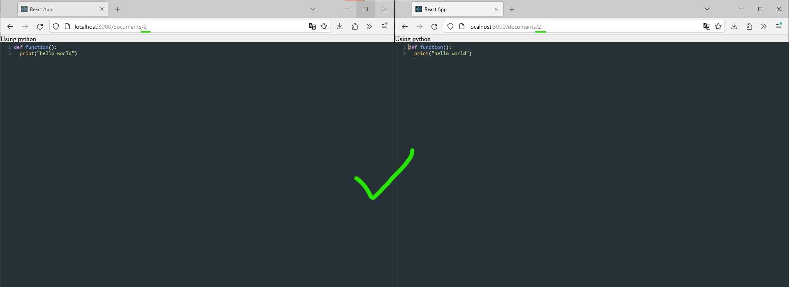

# CodeBros

Codebros is a code editor with collaborative features, similar to google docs or replit

(https://www.youtube.com/watch?v=0XOAz2Qx9Uw)

# how to run


## 1. Start the client:
  - enter client
    ```
    $ cd ../client
    ```

  - install dependencies:
    ```
    npm install
    ```

  - start client
    ```
    npm start
    ```

## 2. in a different terminal, start the server:
  - enter server
    ```
    $ cd ../server
    ```

  - install dependencies:
    ```
    npm install
    ```

  - start server
    ```
    npm run devStart
    ```

## 3. To edit the same code file, make sure the document id name is the same on both brosers 

  - these two docs are unsynced, one has a document id of 1 and one has a document id of 2
    

  - these two docs are synced, they both have a document id of 2
    